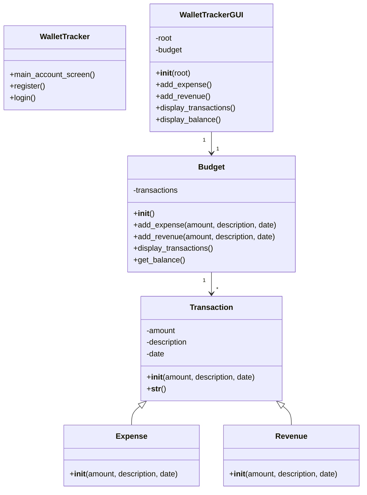

```mermaid
classDiagram
    class WalletTracker {
        +main_account_screen()
        +register()
        +login()
    }

    class WalletTrackerGUI {
        -root
        -budget
        +__init__(root)
        +add_expense()
        +add_revenue()
        +display_transactions()
        +display_balance()
    }

    class Transaction {
        -amount
        -description
        -date
        +__init__(amount, description, date)
        +__str__()
    }

    class Expense {
        +__init__(amount, description, date)
    }

    class Revenue {
        +__init__(amount, description, date)
    }

    class Budget {
        -transactions
        +__init__()
        +add_expense(amount, description, date)
        +add_revenue(amount, description, date)
        +display_transactions()
        +get_balance()
    }

    Transaction <|-- Expense
    Transaction <|-- Revenue
    Budget "1" --> "*" Transaction
    WalletTrackerGUI "1" --> "1" Budget
```
