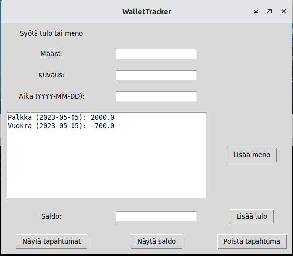

# Käyttöohje

Projektin viimeisimmän releasen saa ladattua klikkaamalla README-tiedoston Lopullinen release-linkkiä ja valitsemalla source code.

## Ohjelman käynnistys

Asenna ensin riippuvuudet komennolla:

```bash
poetry install
```

Tämän jälkeen ohjelman voi käynnistää komennolla:

```bash
poetry run invoke start
```
## Alkunäkymä

Sovellus käynnistyy alkuvalikkoon:


Alkuvalikosta voit valita haluaako kirjautua olemassa olevalle käyttäjälle vai luoda täysin uuden käyttäjän

## Rekisteröinti

Klikkaamalla Rekisteröidy-painiketta alkuvalikossa, aukeaa rekisteröintinäkymä, jossa voi luoda uuden käyttäjätunnuksen ja salasanan uudelle käyttäjälle:


Painamalla Rekisteröidy-painiketta ohjelma luo käyttäjätunnuksesi

## Kirjautuminen

Kun painat Kirjaudu-painiketta alkuvalikossa aukeaa kirjautumisnäkymä:


Nyt voit syöttää olemassa olevan käyttäjätunnuksen ja salasanan ja kirjautua tilillesi.

## Käyttäjätilin näkymä

Kun olet kirjautunut sisään, aukeaa ohjelman päänäkymä:


Päänäkymässä voit lisätä menoja ja tuloja, tarkastella tapahtumia ja nykyistä saldoa sekä poistaa viimeisimmän tapahtuman.

## Tapahtumien lisääminen

Saat lisättyä tuloja ja menoja lisäämällä määrän, kuvauksen sekä päivämäärän niitä vastaaviin tekstikenttiin ja painamalla "Lisää tulo" tai "Lisää meno" tapahtuman tyypistä riippuen:


## Tapahtumien tarkastelu

Kun olet syöttänyt tapahtumia, voit tarkastela niitä painamalla "Näytä tapahtumat"-painiketta:



## Saldon tarkastelu

Kun olet syöttänyt tapahtumia, voit tarkastella tämän hetken saldoa painamalla "Näytä saldo"-painiketta:


## Tapahtumien poistaminen

Kun olet syöttänyt tapahtumia, voi poistaa viimeisimmän tapahtuman painamalla "Poista tapahtuma"-painiketta:


Tililtä pääsee automaattisesti kirjautumaan ulos sulkemalla ohjelman ikkunan oikeassa yläkulmassa olevasta "X"-painikkeesta.
