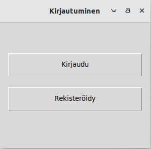

# Käyttöohje
Projektin viimeisimmän releasen saa ladattua klikkaamalla README-tiedoston Lopullinen release-linkkiä ja valitsemalla source code.
## Ohjelman käynnistys

Asenna ensin riippuvuudet komennolla:

```bash
poetry install
```

Tämän jälkeen ohjelman voi käynnistää komennolla:

```bash
poetry run invoke start
```
## Alkunäkymä

Sovellus käynnistyy alkuvalikkoon:



## Kirjautuminen

## Rekisteröinti

## Käyttäjätilin näkymä
