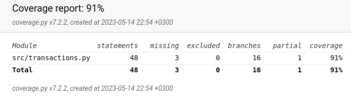

# Testausdokumentti

Ohjelmaa on testattu unittestilla sekä manuaalisesti järjestelmätason testeillä.

## Unittest-testaus

### Testauskattavuus

Käyttöliittymän komponentteja lukuunottamatta testauskattavuus on 91%

## Järjestelmätestaus

Järjestelmätestaus on suoritettu manuaalisesti

### Toiminnallisuudet

Kaikki vaatimusmäärittelyn toiminnallisuudet on testattu ja todettu toimiviksi.

## Sovellukseen jääneet laatuongelmat

- Virheilmoitukset puuttuvat käyttäjätilin päänäkymän "Lisää meno", "Lisää tulo" sekä "Poista tapahtuma"-painikkeiden kohdalla
