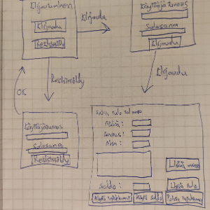

# Vaatimusmäärittely
## Sovelluksen tarkoitus
Sovelluksen tarkoituksena on tarjota käyttäjälle keinoja seurata ja suunnitella omaa rahankäyttöään. Useampi käyttäjä voi kirjautua sovellukseen ja seurata mihin rahat kuluvat syöttämällä tulojaan ja menojaan sovellukseen niin että vain kirjautuneella käyttäjällä on pääsy omiin tapahtumiinsa.

## Käyttäjät
Sovelluksessa on tämän hetken suunnitelman mukaan vain normaali käyttäjä, mutta mahdollisesti käyttäjiä saatetaan lisätä myöhemmin.

## Käyttöliittymäluonnos

## Perusversion tarjoama toiminnallisuus

### Ennen kirjautumista
-Käyttäjä voi luoda käyttäjätunnuksen ja salasanan\
-Käyttäjä voi kirjautua sisään omalle käyttäjätililleen

### Kirjautumisen jälkeen
-Käyttäjä voi syöttää omia menoja ja tuloja järjestelmään\
-Käyttäjä voi tarkastella syöttämiään tapahtumia\
-Käyttäjä voi tarkastella nykyistä rahasaldoa\
-Käyttäjä voi poistaa viimeisimmän syötetyn tapahtuman\
-Sovellus tallentaa käyttäjän tiedot sekä käyttäjän tilin tapahtumien tiedot

## Jatkokehitysideoita
Ohjelmaa voidaan kehittää ajan puitteissa esimerkiksi seuraavilla ominaisuuksilla:
- Budjettisuunnittelutyökalu: Sovellus voi sisältää työkalun, jonka avulla käyttäjä voi suunnitella päivä-, viikko-, kuukausi- tai vuosibudjetin.
- Tulojen ja menojen seuranta: Sovellus voi auttaa käyttäjää seuraamaan tulojaan ja menojaan ja luomaan raportteja siitä, mihin rahaa käytetään.
- Muistutukset: Sovellus voi lähettää käyttäjälle muistutuksia laskuista ja maksuista.
- Automaattinen kategorisointi: Sovellus voi automaattisesti kategorisoida käyttäjän tilitapahtumia, mikä auttaa käyttäjää ymmärtämään, mihin rahaa käytetään.
- Tavoitesäästöt: Sovellus voi auttaa käyttäjää asettamaan tavoitteita säästämiseen ja seuraamaan edistymistä kohti tavoitteita.
- Maksumuistutukset: Sovellus voi lähettää käyttäjälle muistutuksia tulevista maksuista ja eräpäivistä.

