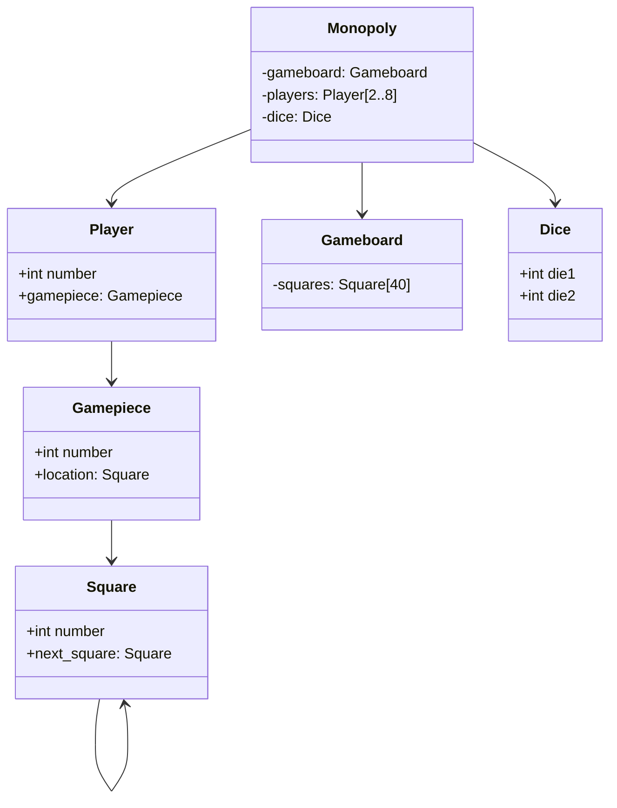

```mermaid
classDiagram
    Player --> Gamepiece
    Gamepiece --> Square
    Square --> Square
    Monopoly --> Gameboard
    Monopoly --> Player
    Monopoly --> Dice
    class Monopoly{
        -gameboard: Gameboard
        -players: Player[2..8]
        -dice: Dice
    }
    class Gamepiece{
        +int number
        +location: Square
    }
    class Player{
        +int number
        +gamepiece: Gamepiece
    }
    class Square{
        +int number
        +next_square: Square
    }
    class Gameboard{
        -squares: Square[40]
    }
    class Dice{
        +int die1
        +int die2
    }
```